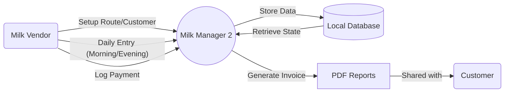
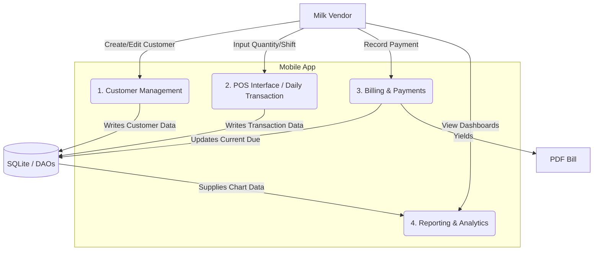
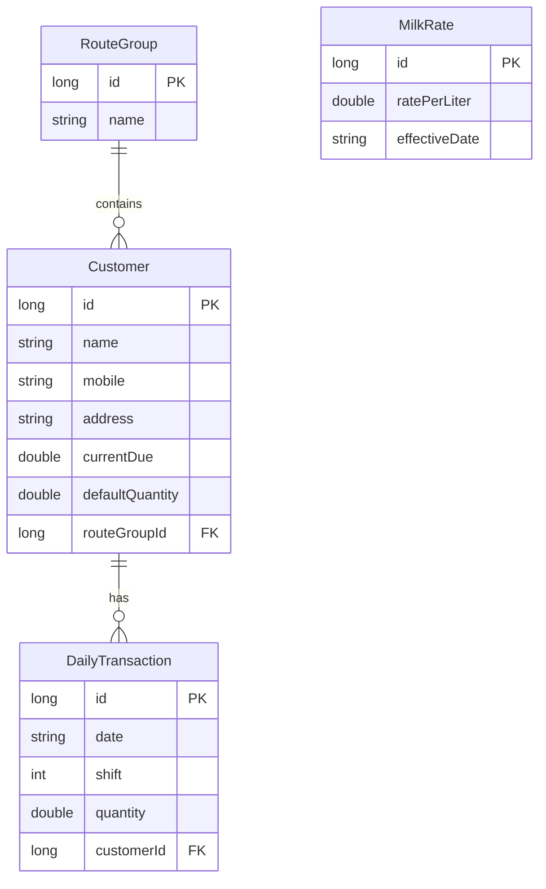
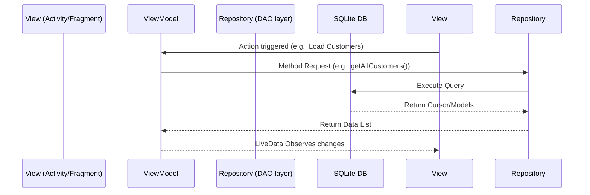

# Data Flow Diagrams (DFD) and System Architecture

This document uses Mermaid.js syntax to visually represent the data pipelines and entity interactions in Milk Manager 2.

## Level 0 DFD (Context Diagram)

The system boundaries and basic inputs/outputs.

## Level 1 DFD (Activity Breakdown)

Breaking down the main modules of the system.

## Entity-Relationship Diagram (ERD)

How the core entities in the `database` relate to each other.

## Architecture: MVVM Structure Flow

